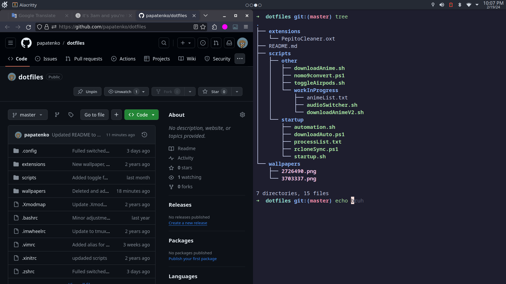

# My dotfiles



This directory contains the dotfiles for my **I use Arch BTW** system.

## Requirements

Base Dependencies:

```bash
yay -S git stow konsave tmux nvim alacritty
```

## Installation

Download:

```bash
git clone git@github.com:papatenko/dotfiles.git
cd dotfiles
```

### Dotfiles in Home

GNU stow to create symlinks:

```bash
# --adopt changes any files found on system to symlink to dotfiles directory
stow --adopt .
```

### KDE Settings

Import file and apply:

```bash
konsave -i ./plasma6.knsv
konsave -a plasma6
```

### Nvim

Install AstroNvim:

```bash
git clone --depth 1 https://github.com/AstroNvim/AstroNvim ~/.config/nvim
nvim
```

User config should work out of the box.

### Tmux

Source config file:

```bash
tmux source ~/.tmux.conf
```

## References

- [GNU Stow](https://www.youtube.com/watch?v=y6XCebnB9gs)
- [ZSH Config](https://www.youtube.com/watch?v=ud7YxC33Z3w)
- [AstroNvim Installation Guide](https://docs.astronvim.com/)
- [Tmux Config](https://hamvocke.com/blog/a-guide-to-customizing-your-tmux-conf/)
